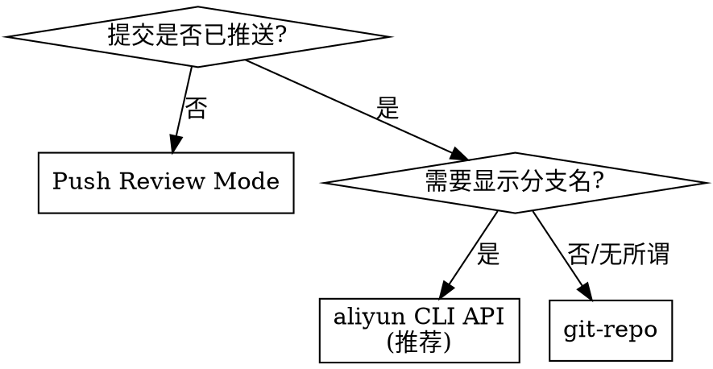

# 云效 CLI

阿里云云效 DevOps 命令行工具。涵盖代码评审、发布管理和任务跟踪。

## 依赖工具

| 工具 | 用途 | 安装方式 |
|------|------|----------|
| Git | 所有操作 | 大多数系统已预装 |
| aliyun CLI | OpenAPI（推荐） | `brew install aliyun-cli` |
| git-repo | `git pr` 命令 | 见 [git-repo.md](references/git-repo.md) |

**无需安装:** Push Review Mode (`git push -o review=...`) 使用标准 Git 即可。

## 创建 MR 方式对比

| 方式 | 显示为 | 适用场景 |
|------|--------|----------|
| Push Review Mode | 分支名 | 提交未推送，最简单 |
| aliyun CLI API | 分支名 | 提交已推送（推荐） |
| git-repo | commit hash | 提交已推送（备选） |

**⚠️ 重要区别**：
- **分支合并请求**: 显示 "将 `feature-branch` 合并至 `main`"
- **Commit 评审**: 显示 "将 `0c556845` 合并至 `main`"（git-repo 方式）

## 创建 MR 决策流程



## 快速参考

### 创建 MR（提交未推送）

```bash
# Push Review Mode - 推送同时创建 MR
git push -u origin <branch> -o review=new
```

### 创建 MR（提交已推送）- 推荐方案

**使用 aliyun CLI API**（显示分支名）：

```bash
# 1. 获取 Repository ID（首次需要）
aliyun devops ListRepositories --organizationId <org-id> | jq '.result[] | {Id, name}'

# 2. 创建分支合并请求
aliyun devops CreateMergeRequest \
  --organizationId <org-id> \
  --repositoryId <repo-id> \
  --body '{
    "title": "feat: your title",
    "description": "Description here",
    "sourceBranch": "<your-branch>",
    "targetBranch": "main",
    "sourceProjectId": <repo-id>,
    "targetProjectId": <repo-id>,
    "createFrom": "WEB"
  }'
```

**必需参数**：`sourceProjectId`, `targetProjectId`, `createFrom: "WEB"`

### 创建 MR（提交已推送）- 备选方案

**使用 git-repo**（显示 commit hash）：

```bash
yes | git-repo upload --single --cbr --dest main \
  --title "feat: your title" \
  --no-edit
```

### 更新已有 MR

```bash
git push origin <branch>  # MR 自动更新
```

### 创建发布 Tag

```bash
git tag -a v1.0.0 -m "Release v1.0.0"
git push origin v1.0.0
```

### 查看合并请求

```bash
aliyun devops ListMergeRequests \
  --organizationId <org-id> \
  --orderBy created_at \
  --pageSize 50
```

### 查看任务

```bash
# 1. 列出组织
aliyun devops ListOrganizations --minAccessLevel 5

# 2. 列出项目（注意: 必须加 --category Project）
aliyun devops ListProjects --organizationId <org-id> --category Project

# 3. 列出任务
aliyun devops ListWorkitems \
  --organizationId <org-id> \
  --spaceIdentifier <project-id> \
  --spaceType Project \
  --category Task
```

### 创建任务

```bash
# 1. 获取工作项类型
aliyun devops ListProjectWorkitemTypes \
  --organizationId <org-id> \
  --projectId <project-id> \
  --category Task \
  --spaceType Project

# 2. 获取必填字段（含自定义字段）
aliyun devops ListWorkItemAllFields \
  --organizationId <org-id> \
  --spaceIdentifier <project-id> \
  --spaceType Project \
  --workitemTypeIdentifier <task-type-id> \
  | jq '.fields[] | select(.isRequired == true) | {identifier, name, options}'

# 3. 创建任务
aliyun devops CreateWorkitem \
  --organizationId <org-id> \
  --body '{
    "subject": "任务标题",
    "space": "<project-id>",
    "spaceIdentifier": "<project-id>",
    "spaceType": "Project",
    "category": "Task",
    "workitemType": "<task-type-id>",
    "workitemTypeIdentifier": "<task-type-id>",
    "assignedTo": "<user-id>",
    "fieldValueList": [
      {"fieldIdentifier": "<field-id>", "value": "<value>"}
    ]
  }'
```

**⚠️ 重要陷阱:**

- `space` 和 `spaceIdentifier` 必须**同时提供**，值相同
- `workitemType` 和 `workitemTypeIdentifier` 必须**同时提供**，值相同
- 项目的自定义必填字段必须在 `fieldValueList` 中提供
- `priority` 等选项字段使用 `identifier`（如 `c31cc...`），不是 `displayValue`

详见 [references/openapi.md](references/openapi.md)

## 常见错误

| 错误 | 原因 | 解决方案 |
|------|------|----------|
| "Everything up-to-date" | Push Review 无法处理已推送的提交 | 用 aliyun CLI 或 git-repo |
| "no branches ready for upload" | git-repo 找不到新内容 | 用 `--cbr --dest main` |
| MR 显示 commit hash | 用了 git-repo | 改用 aliyun CLI API |
| "MissingsourceProjectId" | API 缺少必需参数 | 添加 sourceProjectId, targetProjectId |
| "MissingcreateFrom" | API 缺少必需参数 | 添加 `createFrom: "WEB"` |
| 脚本卡在 (y/N) | git-repo 的确认提示 | 用 `yes \|` 管道 |
| "category is mandatory" | ListProjects 缺少参数 | 添加 `--category Project` |
| "字段【xxx】不能为空" | CreateWorkitem 缺少必填字段 | 用 ListWorkItemAllFields 获取必填字段 |
| "Missingspace" | 需要同时提供两个字段 | body 中同时包含 space 和 spaceIdentifier |

## 详细指南

- **git-repo 安装与命令:** 见 [references/git-repo.md](references/git-repo.md)
- **Push Review Mode 选项:** 见 [references/push-review.md](references/push-review.md)
- **OpenAPI 参考:** 见 [references/openapi.md](references/openapi.md)
